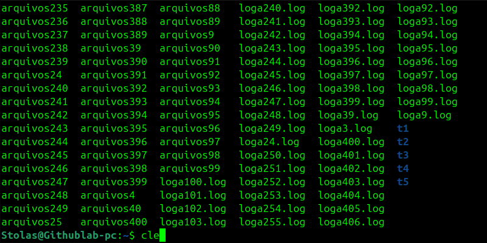

## 💣 Bomba de arquivos e organização eficiente

Este cenário simula uma resposta a incidentes onde precisamos isolar arquivos de log específicos criados recentemente e manter uma trilha de auditoria de cada arquivo movido.

### Cenario 1:
1. **Gerar a massa de dados:** Criar 500 arquivos.
2. **Filtragem Inteligente:** Localizar apenas arquivos `.log`.
3. **Isolamento Seguro:** Mover os arquivos para uma pasta de quarentena sem deletar dados.
4. **Auditoria (Log do Log):** Registrar cada movimentação em um arquivo externo em tempo real.

   

### Resolução Técnica:

```bash
# 1. Preparação do ambiente
mkdir -p /tmp/quarentena
touch file{1..500}.txt file{1..500}.log

# 2. Execução da Pipeline de Automação
find . -name "*.log" -type f | xargs -I {} mv -v {} /tmp/quarentena/ | tee movimentacao.txt

```
   


Em cenarios reais as vezes podem vir bombas de arquivos indesejados, é importante deslocar-los de forma corrata, abaixo temos outro cenario:
### Cenario 2 :
1. **Maasa de daods recentes:** Uma massa de dados foi gerada em um local indevido.
2. **Filtragem Inteligente:** filtre e isole os log's que foram GERADOS NOS ULTIMOS 10 minutos.
3. **Isolamento Seguro:** Mover os arquivos para uma pasta de quarentena sem deletar dados.
4. **Auditoria (Log do Log):** Registrar cada movimentação em um arquivo externo em tempo real.
